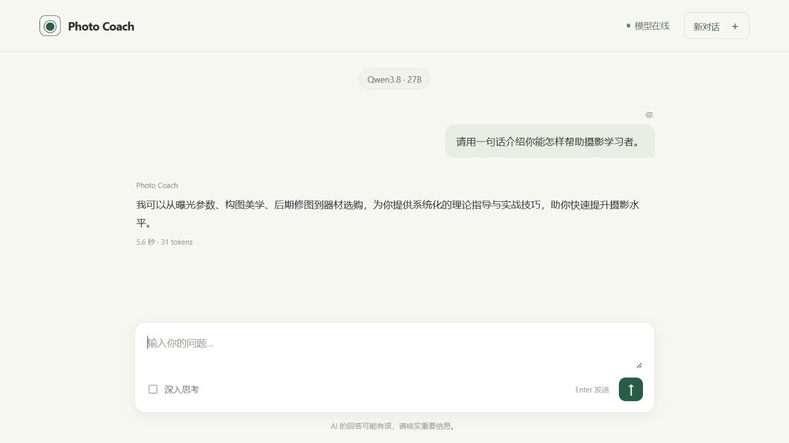

# Photo Coach Local AI

**一张 RTX 3090，在 Windows 上运行 Qwen3.8-27B，并通过自己的云服务器提供 HTTPS 聊天网页。**

模型推理留在本地电脑；云服务器运行 Nginx 和 FRP，负责公网接入。项目包括流式聊天、访问密码、自动排队、取消等待、停止生成、Windows 启动器，以及详细的中文安装教程。



## 已跑通的配置

| 项目 | 实际配置 |
| --- | --- |
| 本地电脑 | Windows 11 Pro，Ryzen 7 5800X，32 GB 内存 |
| GPU | RTX 3090，24 GB 显存，驱动 591.86 |
| 容器 | Docker Desktop 4.93.0 + WSL 2 |
| 推理框架 | vLLM 0.31.0，PyTorch 2.13.0+cu130 |
| GGUF 插件 | 源码提交 `e2b8ad532b8b5ea175100202c30430c1d2b5e6a8` |
| 聊天模型 | `unsloth/Qwen3.8-27B-GGUF`，`UD-Q4_K_M` |
| 模型权重 | 16.46 GB；另需 0.93 GB 的 `mmproj-BF16.gguf` |
| 网页后端 | Python 3.12 + FastAPI + Uvicorn，单进程 |
| 公网服务器 | Ubuntu 24.04，2 vCPU / 4 GB 内存 / 6 Mbps，无 GPU |
| 公网连接 | HTTPS + FRP 0.71.0 WSS，默认网站端口 3389 |
| 多人使用 | 单条生成，先进先出，最多 16 条等待消息 |

仓库不包含模型权重、访问密码、转发令牌、服务器证书或个人服务器地址。

## 从哪里开始

1. [完整 Windows 安装教程](docs/INSTALLATION.zh-CN.md)：硬件、驱动、WSL、Docker、模型下载、镜像构建、本地聊天。
2. [公网发布教程](docs/PUBLIC_DEPLOYMENT.zh-CN.md)：云服务器、防火墙、FRP、HTTPS、开机启动、排障。
3. [实测速度与复现方法](docs/BENCHMARKS.zh-CN.md)：原始数据、测试口径、性能限制。
4. [安全与开源边界](SECURITY.md)：密码、队列、代理和模型许可证。
5. [Twitter/X 发布文案](docs/TWITTER.zh-CN.md)：可直接使用的中英文短帖和中文线程草稿。

## 安装主线

以下命令只是索引；第一次安装请逐步阅读完整教程，先确认 Docker GPU 测试成功。

```powershell
git clone https://github.com/kingbackyang/photo-coach-local-ai.git
Set-Location photo-coach-local-ai
py -3.12 -m venv C:\AIInference\runtime\chat-venv
$python = 'C:\AIInference\runtime\chat-venv\Scripts\python.exe'
& $python -m pip install -r requirements.txt
& $python scripts\download_modelscope.py --group chat --root C:\AIModels
& $python scripts\prepare_image_build.py
docker build --network none -t local/vllm-gguf:qwen38-e2b8ad5 docker/vllm-gguf
.\scripts\start-model.ps1
& $python chat\setup.py
& $python -m uvicorn chat.app:app --host 127.0.0.1 --port 8088 --workers 1 --no-proxy-headers
```

然后打开 `http://127.0.0.1:8088/`。随机密码位于 `%LOCALAPPDATA%\InferenceChat\access.txt`。公网部署需要另外完成服务器配置，见上面的教程。

## 实测速度

2026-10-05，在上述 3090 上预热后，每个用例重复 3 次，关闭深入思考。中文短回复的**首个输出约 0.50 秒、生成速度中位数 7.72 tokens/s**；算术与多轮记忆也通过验证。

| 用例 | 首个输出中位数 | 生成速度中位数 | 整条请求中位数 |
| --- | ---: | ---: | ---: |
| 算术 `17 × 19` | 0.495 s | 7.80 tokens/s | 0.880 s |
| 中文摄影建议 | 0.498 s | 7.72 tokens/s | 6.890 s |
| 多轮相机型号记忆 | 0.717 s | 7.93 tokens/s | 1.345 s |

这是短提示、2048 tokens 上下文、单条生成时的实测，不代表长上下文、冷启动或多人排队时的总响应时间。原始数据：[rtx3090-20261005.json](benchmarks/rtx3090-20261005.json)。

## 当前边界

- 已完成聊天；网页暂未提供上传图片、图像理解、图像生成、文件检索、用户账号或持久化聊天记录。
- Qwen-Image-2.1 的 GGUF、VAE、文本编码器已下载并校验，下载清单包含它们；尚未完成生图推理验证或网页接入。
- vLLM 的 GGUF 支持仍是实验性功能。本项目固定版本与插件提交；升级框架、换模型或换显卡后应重新验证兼容性。[vLLM 官方说明](https://docs.vllm.ai/en/v0.31.0/features/quantization/gguf/)

## 代码结构

```text
chat/                     网页、登录、流式输出、FIFO 队列、Windows 启动器
scripts/                  下载、构建准备、启动、部署生成与验证
docker/vllm-gguf/          固定版本的镜像构建文件
deploy/                   不含凭证的 Nginx 与服务器配置模板
docs/                     完整安装、公网部署、测速、Twitter 草稿
benchmarks/               可公开的真实测试记录
models.lock.json          ModelScope 文件、版本、大小、SHA256
```

应用代码采用 [MIT License](LICENSE)。模型、vLLM、FRP 与其他依赖保持各自许可证；本仓库的 MIT 许可不改变模型权重的使用条件。
